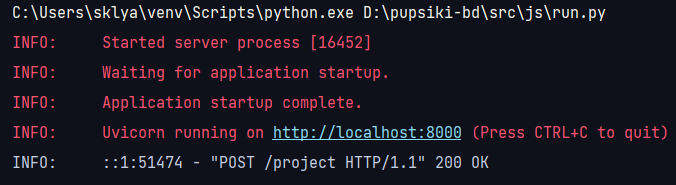
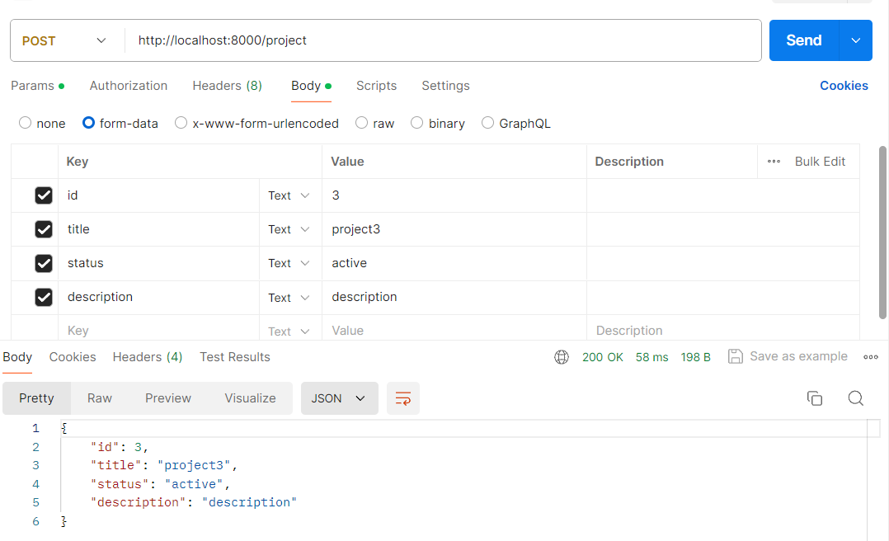
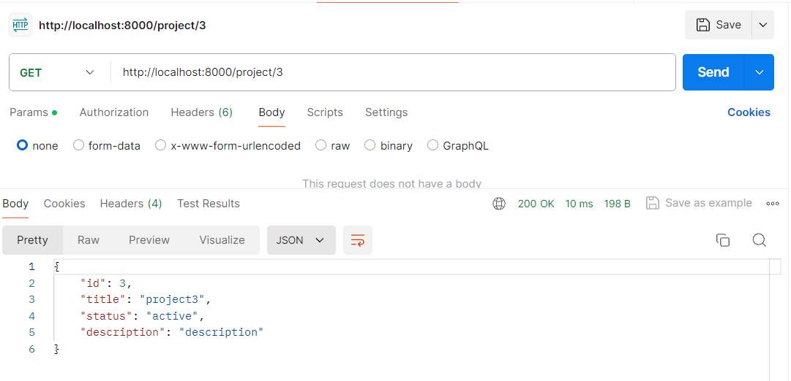
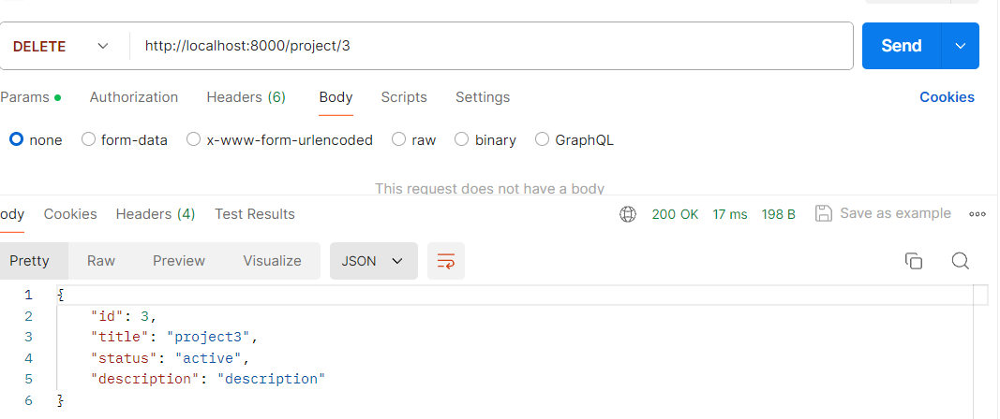
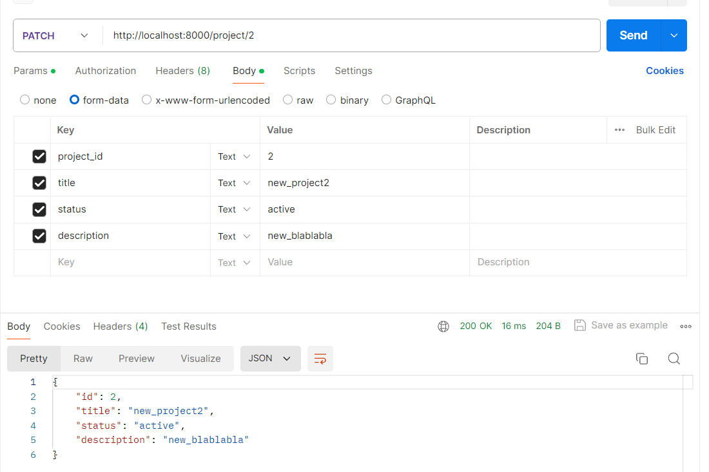
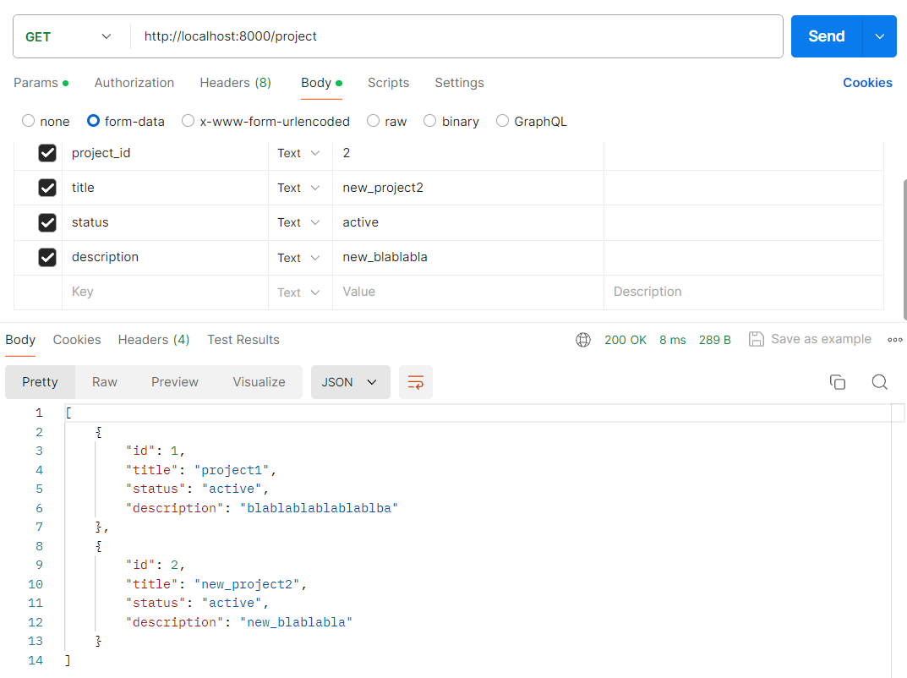
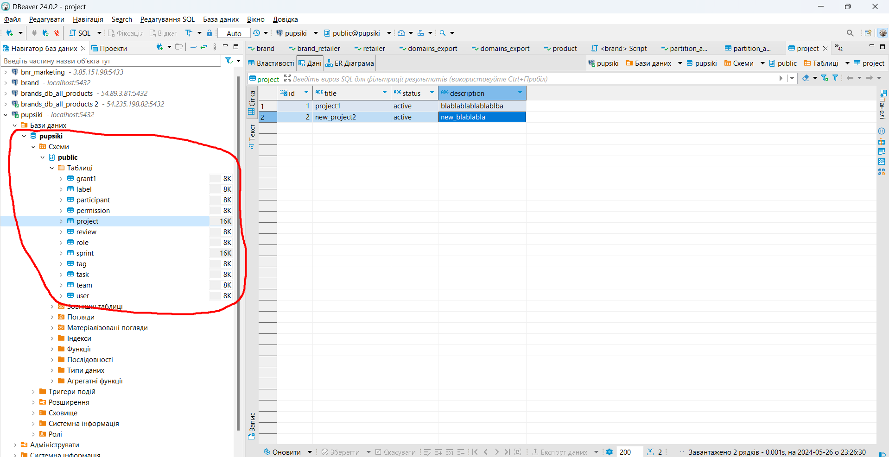

# Тестування працездатності системи

Для тестування я використав postman. Він дозволяє відправляти запити на сервер і перевіряти відповідь.

## Запуск серверу

## Додавання проекту в базу даних

## Отримання всіх проектів

## Отримання проекту по id

## Видалення проекту по id

## Оновлення проекту по id

## Скріншоти з бази даних
